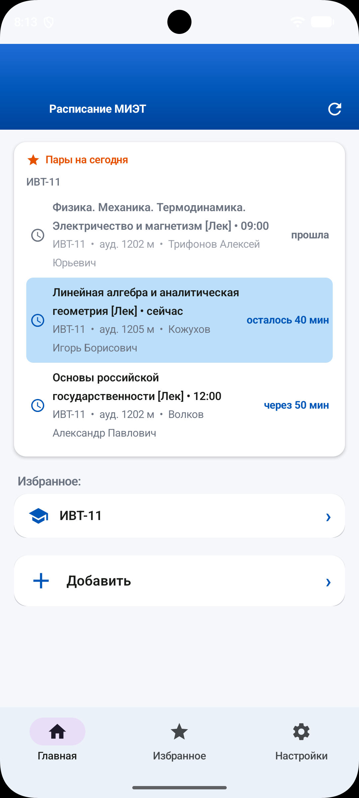
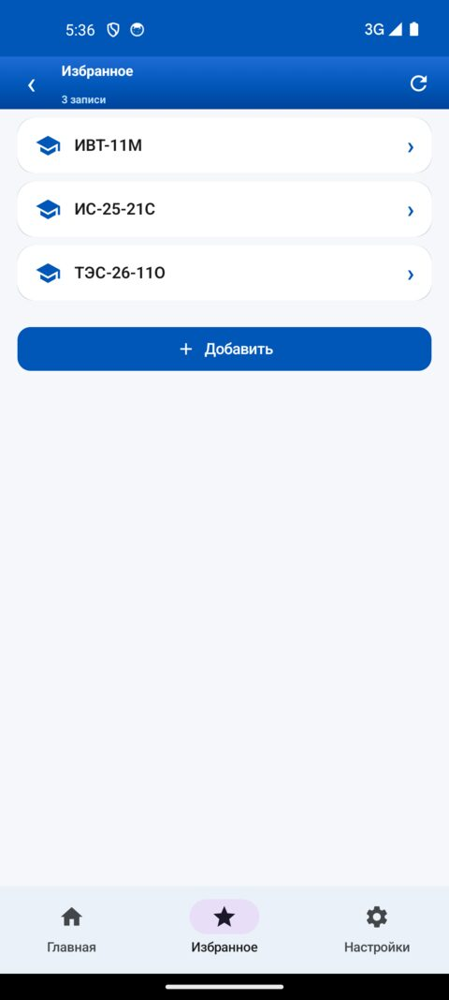
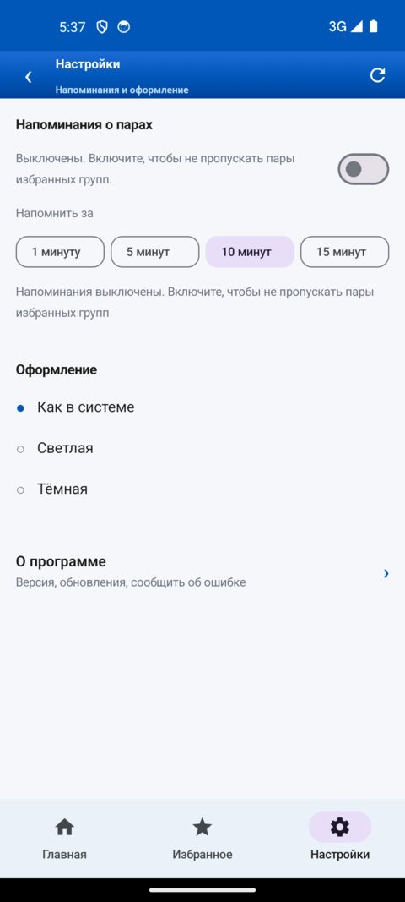
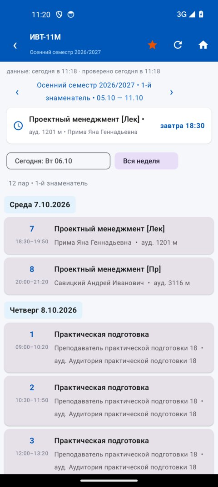
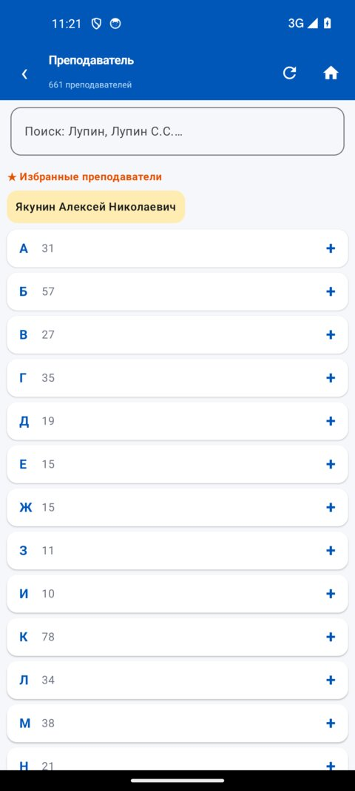
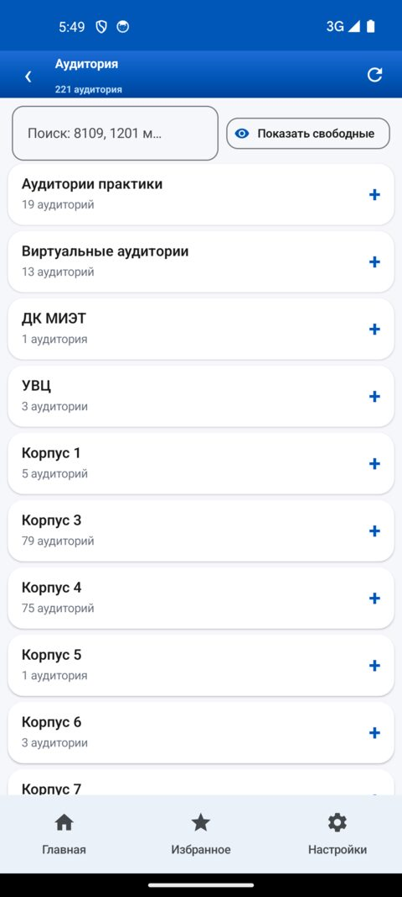

<table>
<tr>
<td width="62%" valign="top">

# Расписание МИЭТ

**Расписание занятий МИЭТ всегда под рукой — по своей группе, по преподавателю или по аудитории.**

Пары на сегодня с отсчётами, избранное с быстрым доступом, напоминания о начале занятий и работа без интернета.

 

 

· ~14 МБ · нужен Android 7.0+

 
 

<b>Как установить?</b>

1. Скачайте APK по кнопке выше.
2. Откройте скачанный файл.
3. Если Android спросит разрешение — разрешите установку из браузера (это стандартный вопрос для файлов не из Google Play).
4. Готово, приложение на рабочем столе.

</td>
<td width="38%" valign="middle" align="center">

</td>
</tr>
</table>

## Что умеет

- **Пары на сегодня** — весь день по порядку, с предметом, аудиторией, преподавателем и временем. Идущая пара подсвечена, у будущих — отсчёт до начала.
- **Расписание с трёх сторон** — как своя группа, как преподаватель по фамилии, как аудитория по номеру.
- **Избранное** — отмечайте звёздами нужные группы, преподавателей и аудитории. Полный список во вкладке «Избранное».
- **Напоминания** — за 1, 5, 10 или 15 минут до начала пары. Работают без интернета.
- **Без интернета** — расписание загружается один раз и хранится на телефоне. Открывается быстро, в метро не тормозит.
- **Обновления** — приложение само проверяет GitHub и предлагает обновиться, если вышел новый релиз.

## Главный экран

Сверху — **пары на сегодня** по всему избранному: весь день по порядку, с
предметом, аудиторией, преподавателем и временем.

- **прошедшие** пары остаются видимыми, но приглушёнными — видно, что уже
  было;
- **идущая** подсвечена и подписана «сейчас», рядом — сколько осталось до её
  конца;
- у **будущих** — сколько ждать до начала;
- список сам подкручивается к идущей паре, чтобы её не приходилось искать.

Когда пары на сегодня закончились, блок говорит об этом прямо и показывает
ближайший день с занятиями — «Завтра» с датой и его парами. Если на сегодня
занятий нет вовсе, вместо списка стоит «Сегодня пар нет» и тот же блок
следующего дня.

Отсчёты обновляются сами каждую минуту.

Ниже — **избранное**: три карточки последних добавленных и строка «Ещё N», если
выбрано больше. Нажатие на карточку открывает расписание сразу, без
промежуточных экранов, — работает и для группы, и для преподавателя, и для
аудитории.

Кнопка **«Добавить»** — как добавить новое.

## Три вкладки внизу

Меню «Главная / Избранное / Настройки» видно на любом экране, активная вкладка
подсвечена.

### Избранное

Полный список всего, что вы отметили: группы, преподаватели, аудитории. Здесь
же кнопка **«Добавить»** — отмечать новое можно прямо с этой вкладки, не
возвращаясь на главную.

Если список пуст, приложение подскажет, как его заполнить.

### Настройки

Всё в одном месте: **напоминания о парах** и интервал до начала пары, **показ
списка избранного на главной**, **оформление** и раздел **«О программе»** — там
версия, проверка обновлений и кнопка «Сообщить об ошибке».

Список избранного на главной нужен не всем: он есть отдельной вкладкой внизу.
Раздел **«Главный экран»** убирает его с главной — остаётся только блок
«Пары на сегодня». При первой установке список показывается.

## Расписание с трёх сторон

### Группа

Выбираете группу из 343 групп МИЭТ — и видите расписание по дням с датами.
Переключаете учебные недели кнопками ‹ ›, причём приложение само показывает,
какая сейчас идёт: «1-й числитель», «2-й знаменатель».

Переключатель «Вся неделя» собирает все дни в один список — удобно, когда
нужно посмотреть неделю целиком, а не сегодняшний день.

На каждой паре видно предмет, аудиторию, преподавателя и время. Если
аудитория меняется от пары к паре, это отмечено прямо в карточке.

### Преподаватель

Поиск по фамилии или инициалам. Сайт МИЭТ не умеет искать по преподавателю,
поэтому приложение собирает расписание само: берёт расписания всех групп и
ищет в них пары с нужной фамилией.

Список делится по буквам алфавита, у каждого имени видно, сколько пар у
преподавателя. Имена можно добавить в избранное звёздочкой.

### Аудитория

Поиск по номеру помещения: `8109`, `1201 м`. Приложение показывает, кто и
когда занимает эту аудиторию.

Кнопка **«Показать свободные»** оставляет только те аудитории, которые
свободны на выбранной паре. На каждой видно, занята ли она сейчас, и если
пара идёт — сколько минут осталось.

Пока список собирается, видно, сколько уже загружено, — экран не выглядит
пустым. Следующий заход на эту вкладку открывается мгновенно: данные уже
сохранены на телефоне.

## Работает без интернета

Расписание загружается с сайта МИЭТ один раз и хранится на телефоне.
Повторно в интернет приложение почти не ходит, поэтому открывается быстро.
Без сети показывает то, что уже сохранено.

## Напоминания о парах

Включаются в «Настройках». Можно попросить напоминать за 1, 5, 10 или 15 минут
до начала пары. Напоминания ставятся для групп из избранного и **работают без
интернета** — расписание берётся из локальной копии. После перезагрузки
телефона восстанавливаются сами. Тап по напоминанию открывает расписание той
группы, по которой оно пришло.

## Если что-то не работает

Внутри приложения есть кнопка **«Сообщить об ошибке»** — вкладка «Настройки»,
раздел «О программе». Она сама собирает версию приложения, выбранную роль и
состояние данных, так что в письме уже будет вся нужная информация.

## Как это сделано

Расписание берётся с сайта МИЭТ и хранится на телефоне. Расписания
преподавателей и аудиторий сайт не отдаёт напрямую — приложение собирает их
само из расписаний групп.

Данные и код открыты: [исходники на GitHub](https://github.com/DezTimeNow/miet_Schedule).

## Статус

Альфа: функциональность может измениться. Обратная совместимость не
гарантируется.

## Лицензия

Учебный проект. Данные принадлежат МИЭТ.

---

Разработчику: сборка, подпись APK и порядок выпуска — в [RELEASE.md](RELEASE.md).
