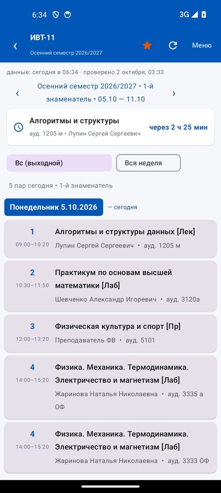
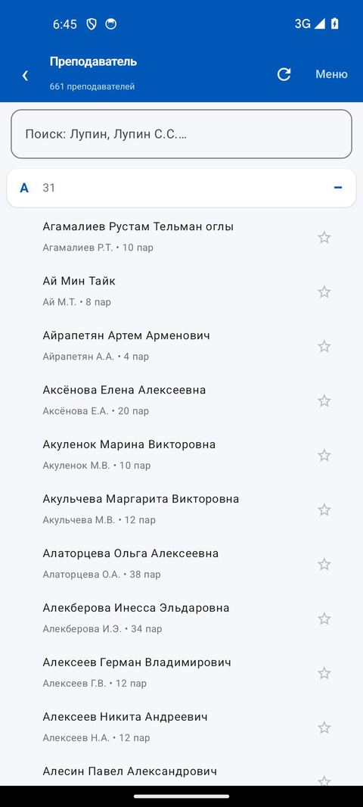
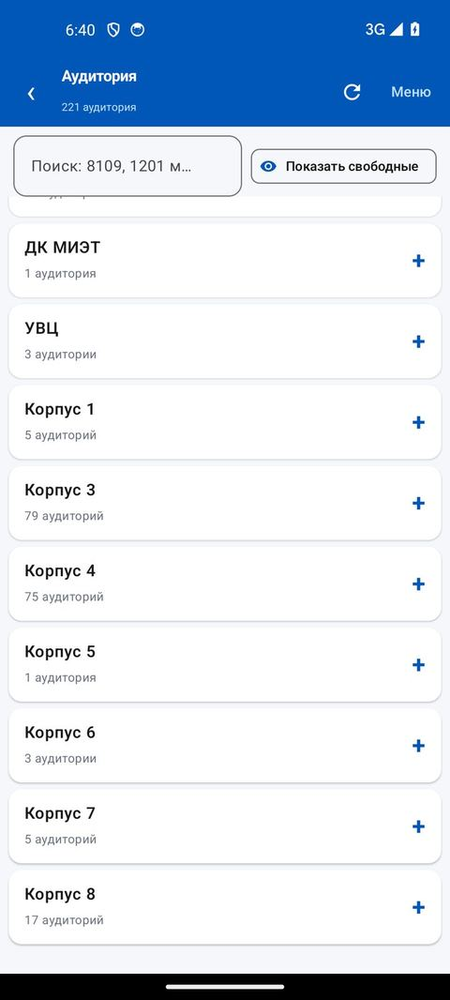
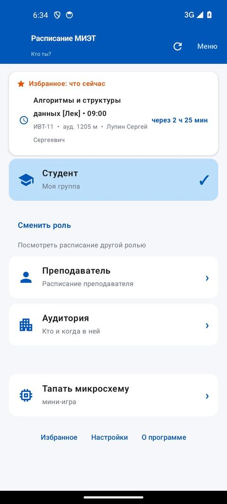
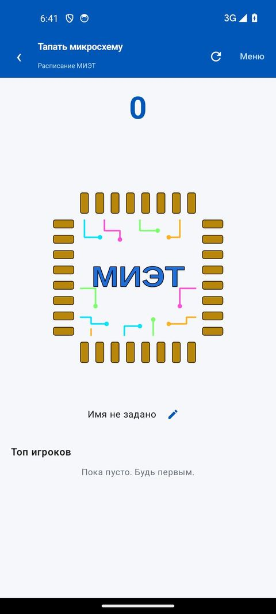

# Расписание МИЭТ

Приложение для Android: расписание занятий МИЭТ — по своей группе, по
преподавателю или по аудитории.

> ВНИМАНИЕ! Приложение на 100% написано ИИскусственным интеллектом, в
> обычном смысле его не понимает даже автор. Съедено более 900 млн токенов.

## Что умеет

### Своё расписание

Выбираете группу из 343 групп МИЭТ — и видите расписание по дням с датами.
Переключаете учебные недели кнопками ‹ ›, причём приложение само показывает,
какая сейчас идёт: «1-й числитель», «2-й знаменатель».

Переключатель «Вся неделя» собирает все дни в один список — удобно, когда
нужно посмотреть неделю целиком, а не сегодняшний день.

На каждой паре видно предмет, аудиторию, преподавателя и время. Если
аудитория меняется от пары к паре, это отмечено прямо в карточке.

### Преподаватель

Поиск по фамилии или инициалам. Сайт МИЭТ не умеет искать по преподавателю,
поэтому приложение собирает расписание само: берёт расписания всех групп и
ищет в них пары с нужной фамилией.

Список делится по буквам алфавита, у каждого имени видно, сколько пар у
преподавателя. Имена можно добавить в избранное звёздочкой.

### Аудитория

Поиск по номеру помещения: `8109`, `1201 м`. Приложение показывает, кто и
когда занимает эту аудиторию.

Кнопка **«Показать свободные»** оставляет только те аудитории, которые
свободны на выбранной паре. На каждой видно, занята ли она сейчас, и если
пара идёт — сколько минут осталось.

### Избранное

Группы, преподаватели и аудитории, отмеченные звёздочкой, собираются в
одном экране.

На главном экране всегда видно, что происходит сейчас и что дальше: предмет,
аудиторию, преподавателя и сколько осталось ждать. Отсчёт обновляется сам
каждую минуту.

### Работает без интернета

Расписание загружается с сайта МИЭТ один раз и хранится на телефоне.
Повторно в интернет приложение почти не ходит, поэтому открыется быстро.
Без сети показывает то, что уже сохранено.

### Напоминания о парах

Можно попросить напоминать за 1, 5, 10 или 15 минут до начала пары.
Напоминания ставятся для групп из избранного и **работают без интернета** —
расписание берётся из локальной копии. После перезагрузки телефона
восстанавливаются сами.

### Мини-игра «Тапать микросхему»

Нажимаете прямо по микросхеме — счёт идёт в общую таблицу игроков, она
обновляется сама. Сброс по понедельникам в 09:00. Нужен интернет: результат
должен быть настоящим.

### Обновления

Приложение само проверяет GitHub и предлагает обновиться, если вышел новый
релиз. Скачанный файл сверяется по контрольной сумме — битый или подменённый
не установится.

## Установка

1. Откройте [Releases](https://github.com/DezTimeNow/miet_Schedule/releases/latest)
   и скачайте APK.
2. Если Android спросит разрешение — разрешите установку из этого приложения.
   Это стандартный вопрос для файлов, скачанных не из магазина.
3. Откройте скачанный файл и установите.

Нужен **Android 7.0 или новее**.

## Если что-то не работает

Внутри приложения есть кнопка **«Сообщить об ошибке»** (раздел «О программе»).
Она сама собирает версию приложения, выбранную роль и состояние данных,
так что в письме уже будет вся нужная информация.

## Как это сделано

Расписание берётся с сайта МИЭТ и хранится на телефоне. Расписания
преподавателей и аудиторий сайт не отдаёт напрямую — приложение собирает их
само из расписаний групп.

Данные и код открыты: [исходники на GitHub](https://github.com/DezTimeNow/miet_Schedule).

## Статус

Альфа: функциональность может измениться. Обратная совместимость не
гарантируется.

## Лицензия

Учебный проект. Данные принадлежат МИЭТ.

---

Разработчику: сборка, подпись APK и порядок выпуска — в [RELEASE.md](RELEASE.md).